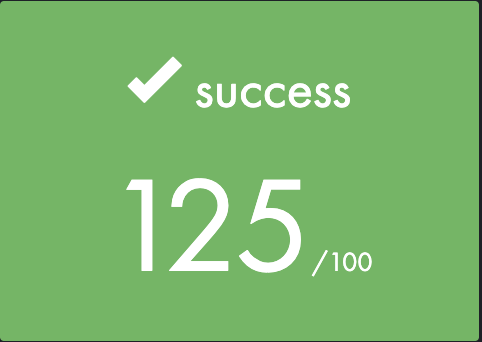
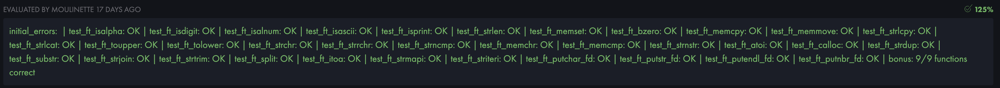

# libft_42 - My Own C Standard Library

## Overview

Welcome to **libft_42**! This repository contains my implementation of the **C Standard Library** functions for the **42 -> 1337 KH** curriculum, known as **Libft**. The goal of this project was to recreate several standard C functions from scratch, building a personal and customized library for future projects and exercises within the **42 Network -> 1337 KH**.

In this project, I implemented various low-level functions that are essential for any C programmer, including memory manipulation, string handling, and utility functions. The objective was not only to understand how these functions work but also to practice writing efficient and clean C code.

---

## Project Goals

- Recreate the core functions of the C Standard Library to better understand their inner workings.
- Practice efficient memory management, pointer manipulation, and error handling.
- Ensure each function is optimized for performance and robust enough to handle edge cases.
- Expand knowledge of **C programming** and become more comfortable with low-level system programming.

## Screenshots

Here are some screenshots of my project implementation:

### Key Functions Implemented

This library implements a wide range of functions that can be categorized into several groups:

1. **Memory Allocation**
   - `malloc`, `free`, `calloc`
   - Memory management functions that are essential for dynamic memory allocation.

2. **String Manipulation**
   - `strlen`, `strcpy`, `strcat`, `strcmp`, `strdup` ...
   - Essential string functions for working with character arrays.

3. **Character Manipulation**
   - `isdigit`, `isalpha`, `isprint`, `toupper`, `tolower`
   - Functions that help check or manipulate individual characters.

4. **Memory**
	- `memcmp`, `memmove`, `memcpy`, `memchr`, `memset`

5. **Utility Functions**
   - `atoi`, `itoa`, `strchr`, `strstr` ...
   - Helper functions for number conversions, searching in strings, and more.
6. **File Descreptors**
	- `ft_putchar_fd`, `ft_putstr_fd`, `ft_putnbr_fd` ...
6. **Linked List Functions**
   - `lstnew`, `lstadd_front`, `lstadd_back`, `lstsize`, `lstdelone`, `lstclear`, `lstiter`, `lstmap`
   - Data structure functions to work with singly linked lists.

Each function was implemented with thorough attention to detail, ensuring they mimic the behavior of the corresponding **C Standard Library** function.

---

## License

This project is licensed under the **MIT License**. You are free to use, modify, and distribute this library under the terms of the license.

---

## Acknowledgments

I would like to thank **42 -> 1337 KH** for providing such an excellent curriculum that challenges me to grow as a programmer. Special thanks to my peers and mentors for their support and feedback throughout the development of this library.

---

## Contact

For any questions, collaborations, or feedback, feel free to reach out to me:

- [Instagram](https://www.instagram.com/oussama._.farah/)
- Email: oussama05farah@gmail.com
